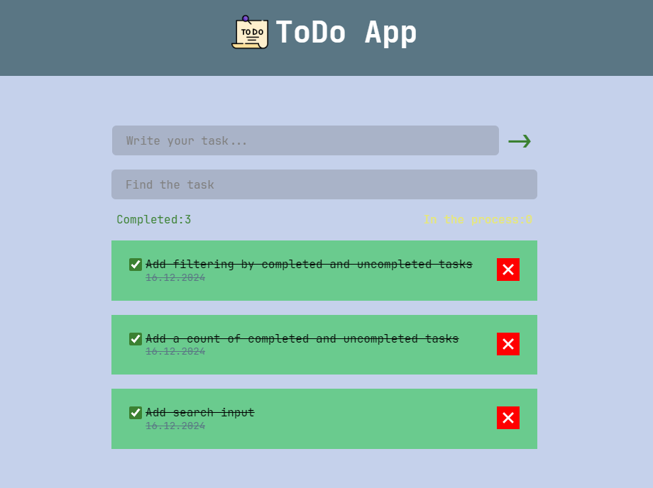

# ToDo App

  

### Functionality

- Tasks are stored in window.localStorage.
- Tasks are sorted by execution status.
- There is a counter for completed and in-progress tasks.
- There's a task search.

### Roadmap

- [x] Add search input
- [x] Add filtering by completed and uncompleted tasks
- [x] Add a count of completed and uncompleted tasks
- [ ] Add several animations for elements
- [ ] Make custom checkbox with default checkbox in html (mask, appearance:none)
